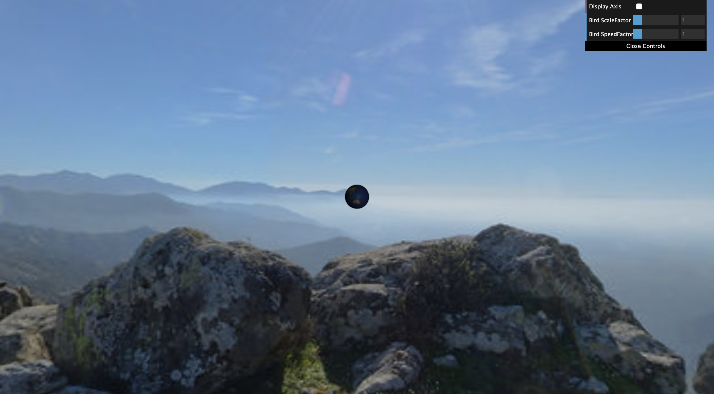

# CG 2022/2023

`A simple WebGL game built on top of the WebCGF library`

## Group T07G03
| Name             | Number    | E-Mail             |
| ---------------- | --------- | ------------------ |
| José Miguel Moreira Isidro         | 202006485 | up202006485@up.pt                |
| João Paulo Jesus Duarte     | 201707984 | up201707984@up.pt                |

----

> Project Grade: 18.4/20

----

## Project Notes

- Implemented MySphere with a radius parameter in the constructor for future portability.
- Added an invert parameter in  MySphere to use for the Panorama effect.
- Created a bird design that ressembles an eagle. It includes spheres, ellipsoids, pyramids and triangles.
- Created a shader to paint the neck of the bird in white and rest of the body with the feather texture in order to ressemble the head and neck of a real eagle.
- Changed the original terrain image and removed the water so we can place all items on the ground.
- Created an egg set to represented all eggs in the scene. Its constructor allows us to define the number of eggs displayed and it generates random positions/rotations for each egg.
- To implement the grove, we decided to use our own textures for the trees, except for the given texture 'billboardtree.png'. We added 'tree2.png' and 'tree3.png'. All are located inside the images folder.
- For extra development, we decided to implement the parabolic trajectory of the egg.

----

## Screenshots

> Screenshot 1 - The Panorama

> Screenshot 2 - The Bird

> Screenshot 3 - The Terrain

> Screenshot 4 - The Eggs & Nest

> Screenshot 5 - The Trees

> Screenshot 6 - Extra development

## Extra Footage

> Gif 6 - Extra development

