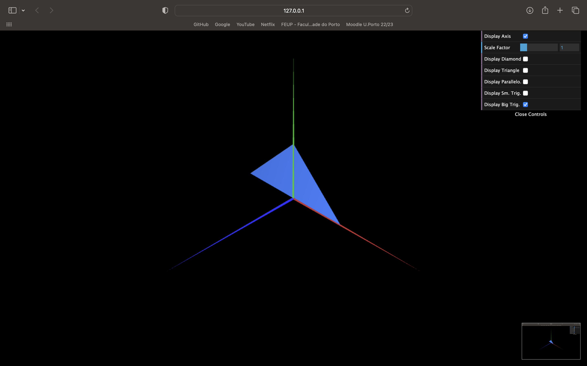

# CG 2022/2023

## Group T07G03

## TP 1 Notes - v2.0

(add your main observations/remarks about your experiments here, in a bulleted list, and remove this line. Some examples below)

- In exercise 1.3 we had difficulties in observing the double-sided parallelogram
- In both exercises, we opted to display the objects in the XY plan.
- Initially, in exercise 2, we  did not draw a right triangle. We have now corrected that.

