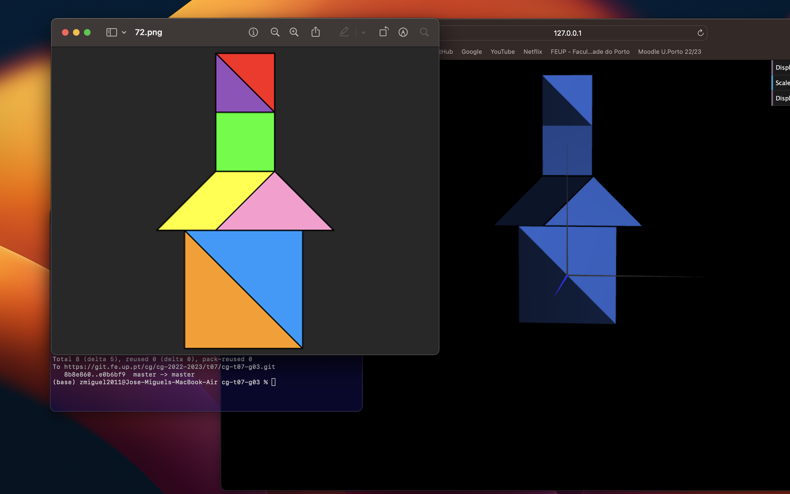
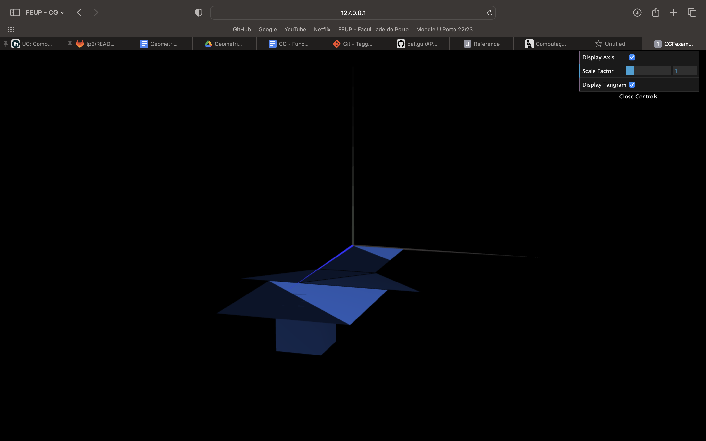
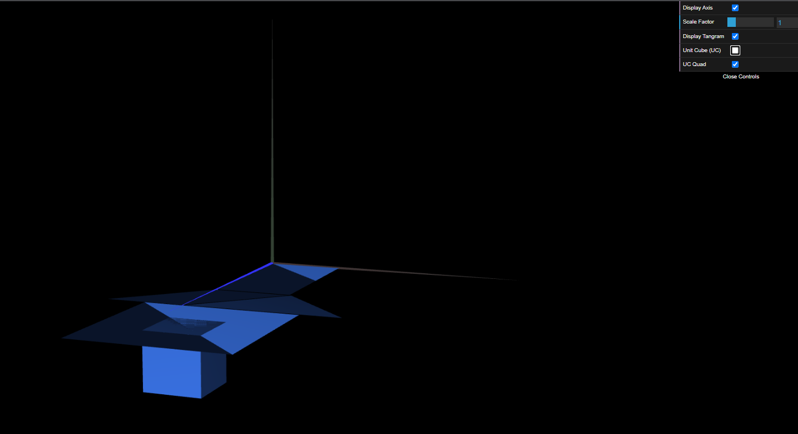

# CG 2022/2023

## Group T07G03

## TP 2 Notes

- In the first exercise, we initially experienced some common problems from working in 3D, such as rotating with different axes
- In the second exercise, more precisely in the last step, and in the last exercise we had some difficulty in understanding the assignment, but we believe we delivered the desired result

