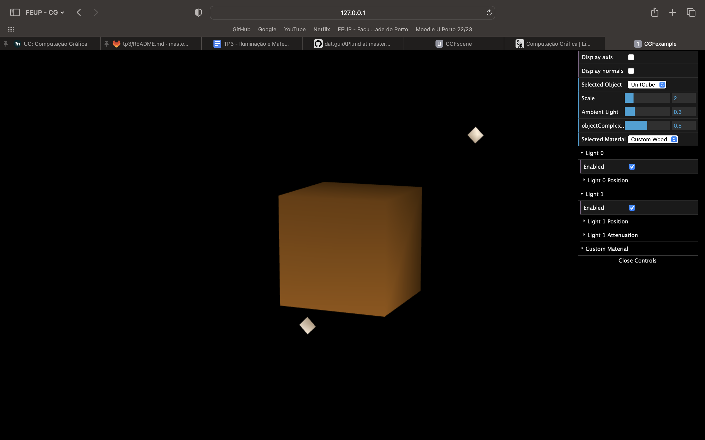
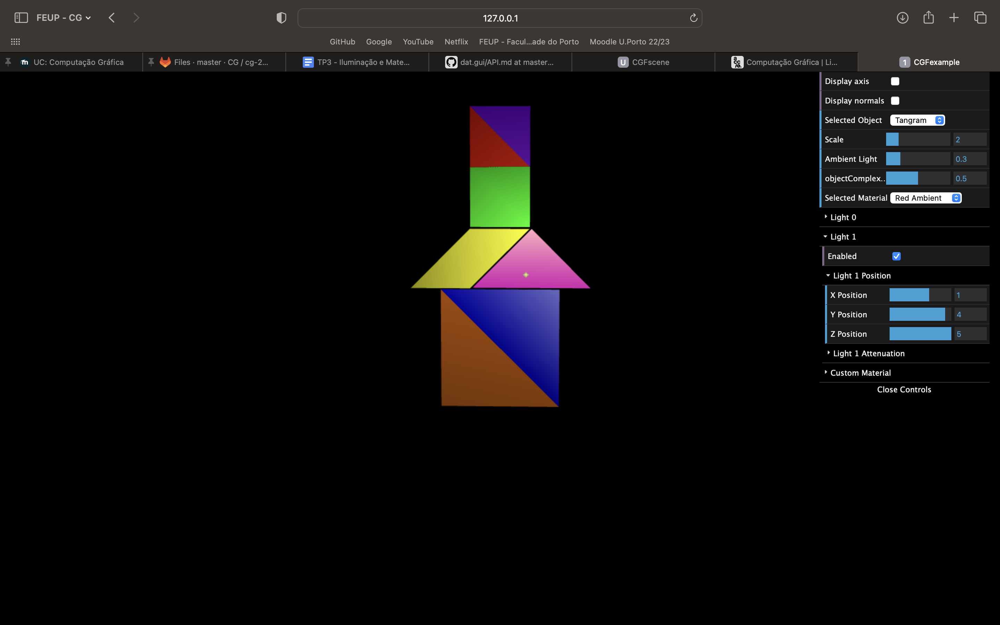
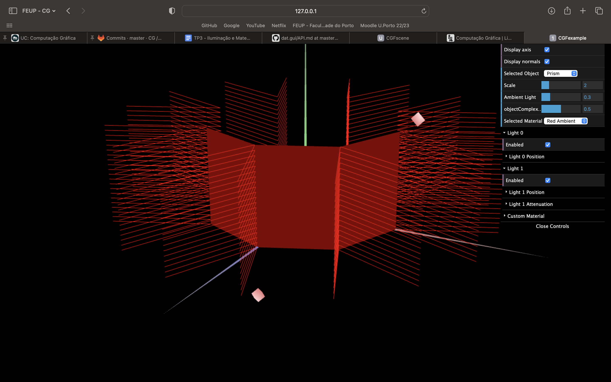
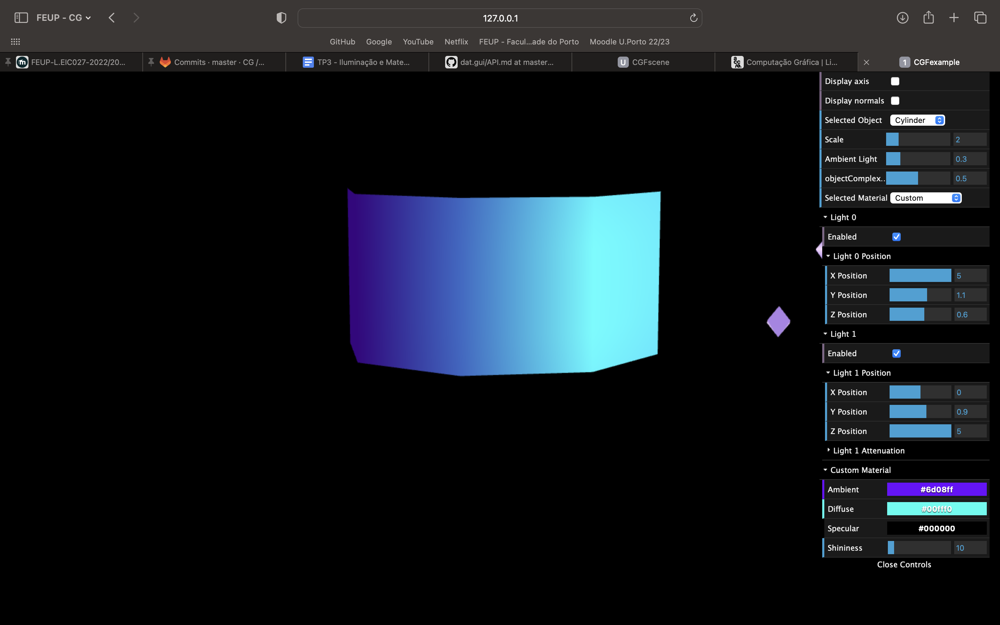

# CG 2022/2023

## Group T07G03

## TP 3 Notes

- In the fourth exercise, creating a material that resembles wood proved to be quite a difficult task, given that we could only change the various light values, but we think the final result was OK.
- In the Tangram, we struggled at first with the rgb values of the colors but managed to fix it afterwards.
- Optimizing the definition of both the vertices and normals for the prism and cylinder was hard at firts, but we believe the final result was great.

