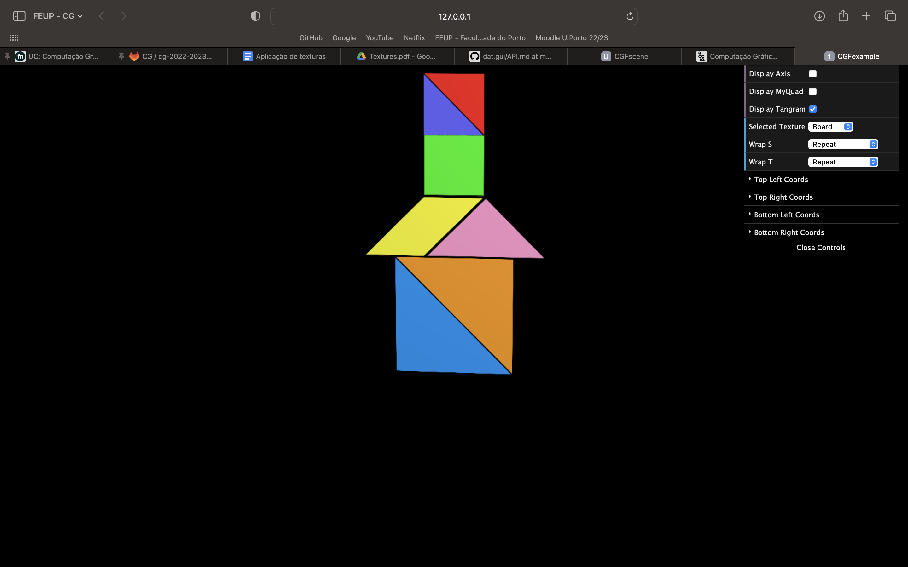
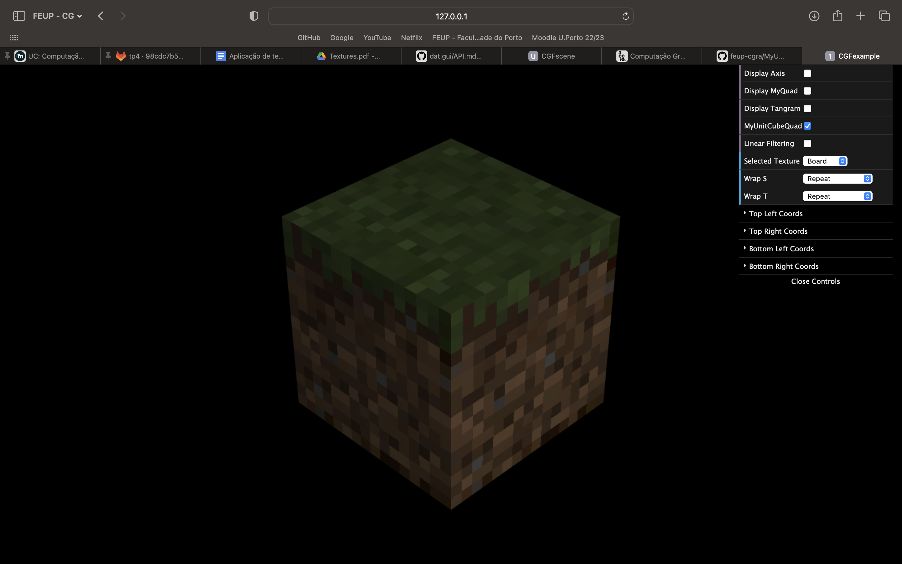

# CG 2022/2023

## Group T07G03

## TP 4 Notes

- In this lab, we've noticed a few mistakes we previously made in the past lessons, such as that noticeable space between the yellow and pink triangles.
- Changed the position of the MyUnitCubeQuad to be in the center of the axis.
- Added a checkbox in the GUI to alternate the texture filtering, for MyUnitCubeQuad, in real time (the default is NEAREST)

